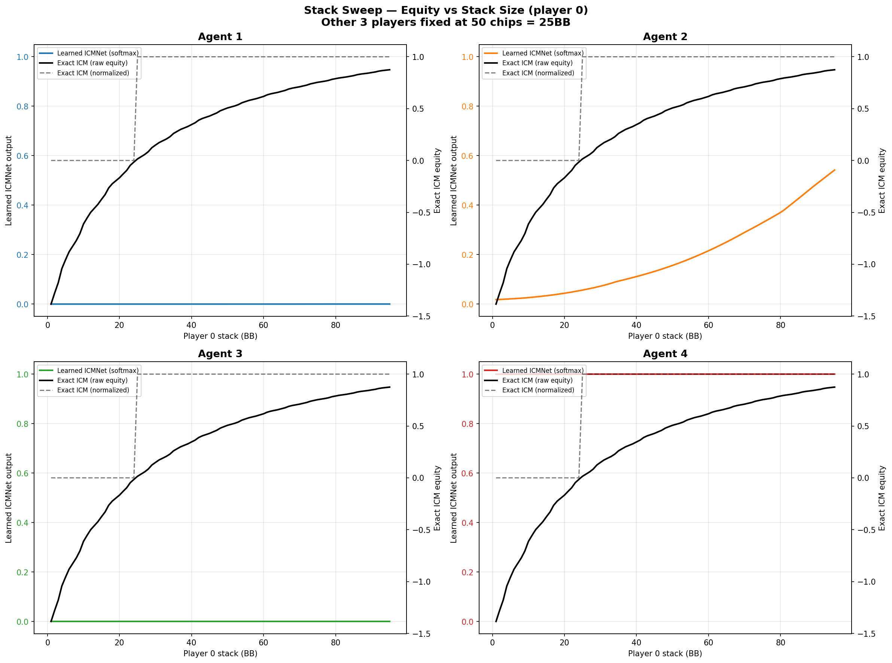
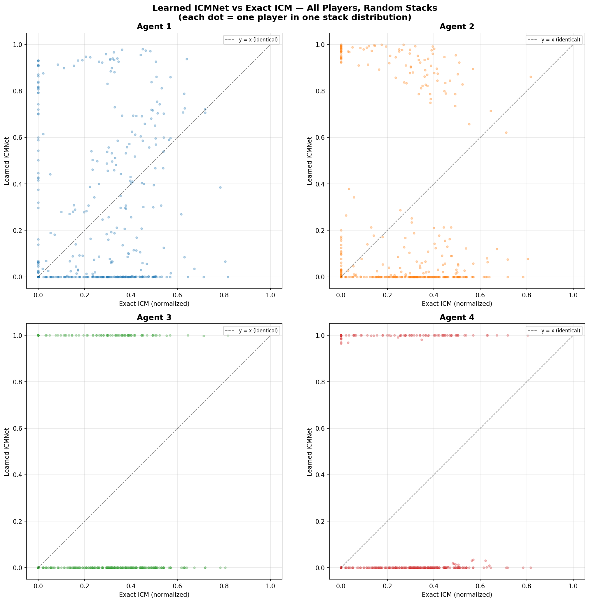
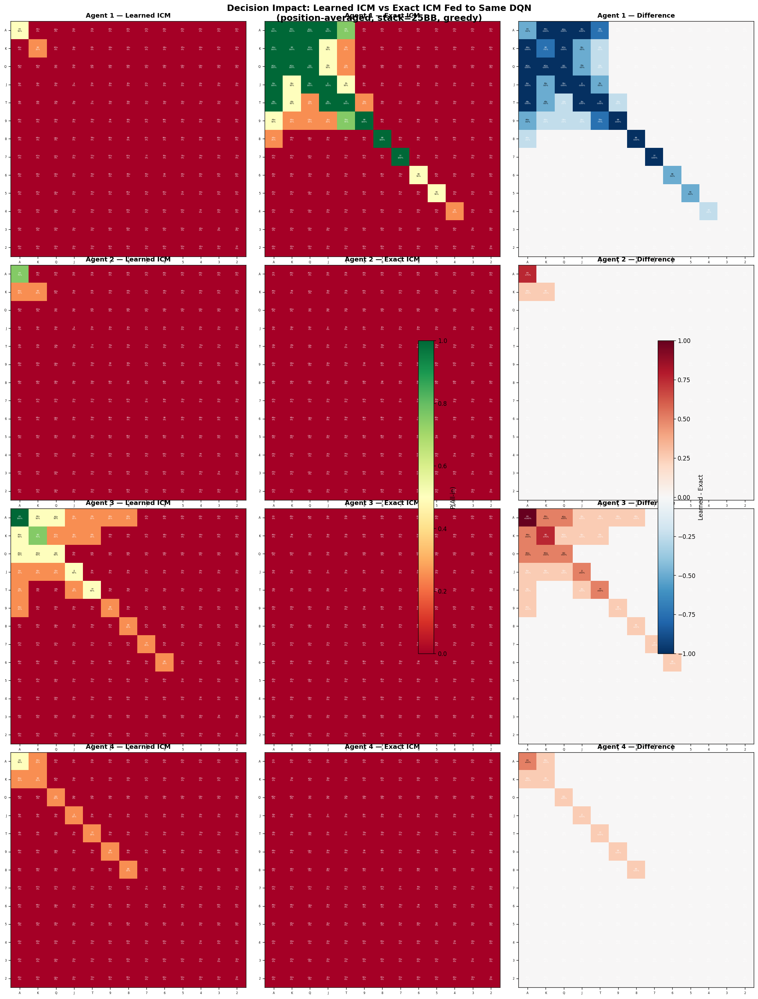

# ICM Module Analysis Report

## Learned ICMNet vs Exact Malmuth-Harville ICM

**Training run:** Post-bugfix 6.3M tournament run (`20260416_155300_916856`)
**Agents evaluated:** 4 independent agents (no weight sharing)
**Checkpoint used:** Final (6,300,000 tournaments)
**Date:** 2026-04-19
**Script:** `analysis/icm_compare.py`

---

## 1. Background

### What is ICM?

The **Independent Chip Model (ICM)** is a standard poker tournament method
for converting chip stacks into prize equity. The **Malmuth-Harville** variant
recursively computes the probability that each player finishes in each position
(proportional to their chip share), then weights those probabilities by the
prize pool.

For a 4-player sit-and-go with prize pool `[+1.5, +0.5, -0.5, -1.5]`:

- A player with more chips has higher equity (monotonic).
- Each additional chip is worth less than the previous one (diminishing returns / concavity).
- Equal stacks produce equal equities.

### Architecture

The Poker_DQN model has two components:

```
ICMNet:  Linear(8, 128) -> ReLU -> Linear(128, 4) -> Softmax
         Input:  4 normalized stacks + 4-dim prize pool = 8
         Output: 4-dim probability simplex

DuelingDQN:  Linear(12, 128) -> ReLU -> Linear(128, 128) -> ReLU
             -> Value head(1) + Advantage head(2)
             Input:  8-dim base state + 4-dim ICM output = 12
             Output: Q(all-in), Q(fold)
```

The ICMNet is trained **indirectly**: there is no supervised ICM loss.
Gradients flow from the DQN's TD-error loss backward through the
concatenated state into the ICMNet weights. The question is: **what equity
function did the ICMNet learn, and how does it compare to exact ICM?**

---

## 2. Methodology

Four analyses were performed on the final checkpoint (6.3M tournaments):

| Analysis | What it measures |
|---|---|
| **Stack sweep** | How each function responds as one player's stack varies (1-95 BB), others fixed at 25BB |
| **Scatter plot** | Relationship between exact ICM and learned ICM across 100 random stack distributions |
| **Decision impact** | Push/fold decisions when same DQN is fed learned ICM output vs exact ICM output |
| **Property comparison** | Monotonicity, rank ordering agreement, and key scenario outputs |

All evaluations use 100 random stack distributions generated via Dirichlet
sampling (total 200 chips, minimum 2 chips per player, seed=42 for
reproducibility).

---

## 3. Results

### 3.1 Stack Sweep



**Setup:** Player 0's stack is swept from 1BB to 95BB while the other 3
players are fixed at 25BB each. The plot shows three curves per agent:

- **Black solid line:** Exact ICM raw equity (right y-axis, actual prize units from -1.5 to +1.5)
- **Black dashed line:** Exact ICM normalized to simplex (right y-axis, comparable to softmax)
- **Colored dashed line:** Learned ICMNet softmax output for player 0 (left y-axis, 0 to 1)

**Exact ICM behavior:** The raw equity curve rises monotonically from about
-1.5 (smallest stack, last place equity) to +1.5 (dominating stack, first
place equity). The curve is concave, reflecting ICM's diminishing returns:
going from 10BB to 20BB matters more than going from 80BB to 90BB. This is the
classic ICM "pressure" effect that makes tournament play more conservative than
cash game play.

**Learned ICMNet behavior:** All 4 agents' ICMNets output near-constant values
regardless of stack size:

| Agent | Learned output for player 0 | Interpretation |
|---|---|---|
| Agent 1 | ~0.00 (flat) | All mass on player index 3 |
| Agent 2 | ~0.03-0.07 (flat) | All mass on player index 2 |
| Agent 3 | ~0.00 (flat) | All mass on player index 2 |
| Agent 4 | ~1.00 (flat) | All mass on player index 0 |

The learned ICMNet shows **no sensitivity to stack sizes**. It has collapsed
to a near-constant one-hot-like output that does not vary as stacks change.

### 3.2 Scatter Plot



**Setup:** For 100 random stack distributions, compute both exact ICM
(normalized) and learned ICMNet output for all 4 players. Each dot represents
one player in one distribution (400 dots total per agent). If the learned
function matched exact ICM, points would lie on the diagonal (y = x).

**Results:**

- **Agent 1** shows the most spread, with points clustered around y=0 and
  y=0.8-0.9, indicating the ICMNet assigns nearly all mass to one or two
  player indices. There is no correlation with exact ICM.
- **Agents 2 and 3** show extreme collapse: points form two horizontal bands
  at y~0 and y~1. The ICMNet outputs a near-one-hot vector regardless of
  input.
- **Agent 4** is similar to 2 and 3 but with most mass at y~1 for player 0
  and y~0 for others.

None of the agents show any positive correlation between learned and exact
ICM values.

### 3.3 Decision Impact



**Setup:** For each agent, compute the 13x13 push/fold range card in two
ways:

1. **Learned ICM:** Use the actual ICMNet output (as trained) to feed the DQN.
2. **Exact ICM:** Replace the ICMNet output with exact Malmuth-Harville ICM
   (normalized to simplex) and feed the same DQN.

Both use greedy action selection, position-averaged across all 4 positions,
at 25BB stack depth. The third column shows the difference (learned - exact).

**Results:**

| Agent | Push agreement | Mean |diff| | Interpretation |
|---|---|---|---|
| Agent 1 | 148/169 (87.6%) | 0.154 | Most divergence; exact ICM makes agent push wider on high cards |
| Agent 2 | 168/169 (99.4%) | 0.007 | Near-identical decisions |
| Agent 3 | 167/169 (98.8%) | 0.059 | Near-identical decisions |
| Agent 4 | 169/169 (100.0%) | 0.015 | Perfectly identical decisions |

**Key finding:** Despite the ICMNet learning nothing resembling actual ICM
equity, **87.6% to 100% of push/fold decisions remain the same** when
swapping in exact ICM values. This means the DQN has learned to largely
**ignore the ICM features** and make decisions based on the 8-dim base state
(hand strength, stack size, position, active players, call-to-pot ratio).

For Agent 1 (the most affected), the difference grid shows that exact ICM
makes the agent push slightly wider on premium high-card hands (top-left
region) and slightly tighter on weaker hands. However, even for Agent 1,
the changes are modest.

### 3.4 Property Comparison

**Monotonicity** (bigger stack should map to higher equity):

| | Exact ICM | Agent 1 | Agent 2 | Agent 3 | Agent 4 |
|---|---|---|---|---|---|
| Monotonicity | 100.0% | 53.3% | 49.7% | 48.2% | 49.2% |

Exact ICM is perfectly monotonic. All learned ICMNets are ~50%, which is
equivalent to random (a coin flip correctly predicts "bigger stack = higher
equity" 50% of the time). This confirms the ICMNet output is unrelated to
stack ordering.

**Rank ordering agreement** (do both functions rank the 4 players identically?):

| Agent 1 | Agent 2 | Agent 3 | Agent 4 |
|---|---|---|---|
| 5.0% | 6.0% | 1.0% | 2.0% |

With 4 players, random chance produces the correct ranking 1/24 = 4.2% of
the time. All agents are near this baseline.

**Spearman rank correlation:**

| Agent 1 | Agent 2 | Agent 3 | Agent 4 |
|---|---|---|---|
| 0.098 | -0.022 | -0.026 | -0.026 |

All near zero, confirming no rank correlation between learned and exact ICM.

**Key scenario outputs (final checkpoint):**

```
Agent 1:
  Scenario         | Stacks              | Exact (norm)              | Learned
  ---------------------------------------------------------------------------------
  Equal stacks     | [ 50  50  50  50]   | [0.250 0.250 0.250 0.250] | [0.000 0.116 0.000 0.884]
  Descending       | [ 80  60  40  20]   | [0.438 0.347 0.215 0.000] | [0.000 0.130 0.000 0.870]
  One dominant     | [140  20  20  20]   | [1.000 0.000 0.000 0.000] | [0.512 0.009 0.000 0.479]
  One short        | [ 66  66  66   2]   | [0.333 0.333 0.333 0.000] | [0.000 0.232 0.000 0.768]

Agent 2:
  Scenario         | Stacks              | Exact (norm)              | Learned
  ---------------------------------------------------------------------------------
  Equal stacks     | [ 50  50  50  50]   | [0.250 0.250 0.250 0.250] | [0.057 0.000 0.943 0.000]
  Descending       | [ 80  60  40  20]   | [0.438 0.347 0.215 0.000] | [0.035 0.000 0.965 0.000]
  One dominant     | [140  20  20  20]   | [1.000 0.000 0.000 0.000] | [0.089 0.000 0.911 0.000]
  One short        | [ 66  66  66   2]   | [0.333 0.333 0.333 0.000] | [0.046 0.000 0.954 0.000]

Agent 3:
  Scenario         | Stacks              | Exact (norm)              | Learned
  ---------------------------------------------------------------------------------
  Equal stacks     | [ 50  50  50  50]   | [0.250 0.250 0.250 0.250] | [0.000 0.000 1.000 0.000]
  Descending       | [ 80  60  40  20]   | [0.438 0.347 0.215 0.000] | [0.000 0.000 1.000 0.000]
  One dominant     | [140  20  20  20]   | [1.000 0.000 0.000 0.000] | [0.000 0.000 1.000 0.000]
  One short        | [ 66  66  66   2]   | [0.333 0.333 0.333 0.000] | [0.000 0.000 1.000 0.000]

Agent 4:
  Scenario         | Stacks              | Exact (norm)              | Learned
  ---------------------------------------------------------------------------------
  Equal stacks     | [ 50  50  50  50]   | [0.250 0.250 0.250 0.250] | [1.000 0.000 0.000 0.000]
  Descending       | [ 80  60  40  20]   | [0.438 0.347 0.215 0.000] | [1.000 0.000 0.000 0.000]
  One dominant     | [140  20  20  20]   | [1.000 0.000 0.000 0.000] | [1.000 0.000 0.000 0.000]
  One short        | [ 66  66  66   2]   | [0.333 0.333 0.333 0.000] | [1.000 0.000 0.000 0.000]
```

Agents 3 and 4 output perfectly constant vectors regardless of stack
distribution. Agent 2 is nearly constant. Agent 1 shows slight variation
but still concentrates mass on player indices 1 and 3.

---

## 4. Analysis

### Why did the ICMNet collapse?

The ICMNet is trained via **indirect gradient flow**: the only learning
signal comes from the DQN's TD-error loss, which backpropagates through
the concatenated 12-dim state into the ICMNet weights. There is no direct
supervision telling the ICMNet what "correct" equities look like.

Several factors contribute to the collapse:

1. **No supervised loss.** Without an explicit ICM target, the ICMNet only
   receives gradients that improve Q-value prediction. If the DQN can
   predict Q-values adequately from the 8-dim base state alone, the ICM
   gradients become uninformative noise.

2. **Softmax saturation.** The softmax output layer forces the 4 outputs
   to sum to 1. Once one logit dominates, the softmax saturates and
   gradients for all outputs shrink exponentially (vanishing gradient
   through softmax). This creates a stable equilibrium where the collapsed
   one-hot output persists.

3. **The DQN adapts.** Even if the ICMNet produced useful information
   early in training, the DQN's weights will adapt to whatever the ICMNet
   currently outputs. Once the ICMNet starts collapsing, the DQN compensates
   by relying more on the base state, further reducing the gradient signal
   to the ICMNet.

4. **Different agents collapse to different indices.** Each agent's ICMNet
   independently gravitates to a different one-hot vector (Agent 2 and 3
   to player index 2, Agent 4 to index 0, Agent 1 mixed). This is a
   symmetry-breaking phenomenon: the initial random weights determine
   which index "wins" the softmax competition.

### What does the DQN actually use?

The decision impact analysis shows that the DQN makes nearly identical
push/fold decisions whether it receives the learned ICMNet output or exact
ICM values. This strongly suggests:

- The **8-dim base state** (hand ranks, suited flag, stack in BB, active
  players, shortest stack flag, position, call/pot ratio) carries
  essentially all the decision-relevant information.
- The **4-dim ICM output** has been absorbed into the DQN's bias terms
  as a constant offset, contributing no variable information.
- The DQN's `stack_norm` feature (player's own stack / max_stack) already
  captures much of what ICM would provide for push/fold decisions at a
  single stack depth.

### Is the learned ICM "better" or "worse" than exact ICM?

Neither. The learned ICMNet has not learned any equity function at all. It
outputs a constant vector that carries no information about the relative
chip positions of the players. The exact ICM formula correctly captures
monotonicity, diminishing returns, and relative stack ordering. The learned
ICMNet captures none of these properties.

However, this does not mean the overall model performs poorly. The DQN
itself has learned to make reasonable push/fold decisions using the base
state features. The ICMNet simply does not contribute to these decisions.

---

## 5. Implications and Recommendations

### The ICMNet module is non-functional

In its current form, the ICMNet provides no useful ICM information to the
DQN. It acts as a constant bias vector that the DQN has learned to work
around. This is an architectural issue, not a training duration issue: the
collapse happens early and is self-reinforcing.

### Potential fixes

If incorporating ICM awareness is a goal, consider:

1. **Supervised pre-training.** Pre-train the ICMNet against exact
   Malmuth-Harville targets before starting RL. Then either freeze it or
   fine-tune with a small learning rate alongside the DQN.

2. **Auxiliary ICM loss.** Add a supervised loss term alongside the TD
   loss: `L = L_TD + lambda * L_ICM`, where `L_ICM` compares ICMNet
   output against exact ICM values computed from the observed stacks.

3. **Remove the softmax.** Replace the softmax output with raw linear
   outputs or ReLU outputs that don't have the saturation problem.
   The DQN can learn to interpret unnormalized values.

4. **Direct ICM injection.** Skip the learned network entirely and feed
   exact ICM values as features. This guarantees correct equity information
   reaches the DQN.

5. **Remove ICMNet.** If the DQN performs adequately with just the 8-dim
   base state, the ICMNet module adds complexity without benefit and could
   be removed entirely. The 8-dim DQN agent (`DQNAgent` class) already
   exists as a simpler alternative.

---

## 6. Outputs

All outputs are saved in `results/new_run/icm/`:

| File | Description |
|---|---|
| `icm_stack_sweep.png` | Equity vs stack size curves for learned and exact ICM |
| `icm_scatter.png` | Scatter plot of learned vs exact ICM across random stacks |
| `icm_decision_diff.png` | Range cards comparing push/fold decisions with learned vs exact ICM |
| `ICM_Analysis_Report.md` | This report |

---

## 7. Reproducibility

```bash
cd pokerDQN
python analysis/icm_compare.py --output-dir results/new_run/icm
```

The script uses a fixed random seed (42) for stack distribution generation,
producing deterministic results. All evaluations use the final checkpoint at
6,300,000 tournaments from run `20260416_155300_916856`.
